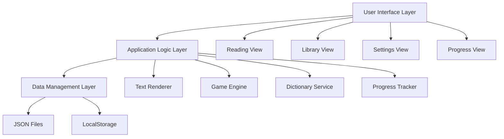

# Design Document

## Overview

日本の名作文学を読解できるゲームアプリケーションの設計書です。本アプリケーションは、JSONファイルから文学作品を読み込み、縦書き表示で子どもにも読みやすく表示し、ゲーム要素を通じて学習を促進するWebアプリケーションとして設計します。

### Technology Stack
- **Frontend**: HTML5, CSS3, JavaScript (ES6+)
- **CSS Framework**: 縦書き表示のためのCSS Writing Modes
- **Data Format**: JSON
- **Storage**: LocalStorage (設定・進捗保存)
- **Architecture**: Single Page Application (SPA)

## Architecture

### System Architecture



### Component Structure

1. **UI Components**
   - BookLibrary: 作品一覧表示
   - BookReader: 縦書き読書画面
   - Dictionary: 語句説明ポップアップ
   - ProgressBar: 読書進捗表示
   - Settings: 設定画面

2. **Core Services**
   - BookLoader: JSON読み込み・パース
   - TextRenderer: 縦書き表示エンジン
   - GameManager: ゲーム要素管理
   - StorageManager: データ永続化

## Components and Interfaces

### BookLoader Service
```javascript
class BookLoader {
  async loadBooks(directory)
  validateBookFormat(bookData)
  parseBookContent(rawData)
  watchForNewBooks()
}
```

### TextRenderer Component
```javascript
class TextRenderer {
  renderVerticalText(content, container)
  handlePageNavigation()
  applyTextSettings(fontSize, lineHeight)
  highlightClickableText()
}
```

### Dictionary Service
```javascript
class DictionaryService {
  getWordDefinition(word)
  getReadingHint(kanji)
  showDefinitionPopup(word, position)
  hideDefinitionPopup()
}
```

### GameManager
```javascript
class GameManager {
  trackReadingProgress(bookId, position)
  awardPoints(action, amount)
  showAchievement(type)
  generateCertificate(bookId)
}
```

## Data Models

### Book Data Structure (JSON)
```json
{
  "id": "unique-book-id",
  "title": "作品タイトル",
  "author": "作者名",
  "category": "author|difficulty|length",
  "difficulty": "beginner|intermediate|advanced",
  "length": "short|medium|long",
  "content": [
    {
      "chapter": 1,
      "title": "章タイトル",
      "text": "本文内容...",
      "annotations": [
        {
          "word": "難しい語句",
          "reading": "よみがな",
          "definition": "子ども向け説明"
        }
      ]
    }
  ],
  "metadata": {
    "totalChapters": 5,
    "estimatedReadingTime": 30,
    "ageRecommendation": "8-12"
  }
}
```

### User Progress Data
```json
{
  "userId": "user-id",
  "books": {
    "book-id": {
      "currentChapter": 2,
      "currentPosition": 150,
      "completedChapters": [1],
      "readingTime": 1200,
      "wordsLearned": ["語句1", "語句2"],
      "points": 250,
      "completed": false,
      "completedDate": null
    }
  },
  "settings": {
    "fontSize": "medium",
    "backgroundColor": "cream",
    "soundEnabled": true
  },
  "achievements": [
    {
      "type": "first_book_completed",
      "date": "2024-01-15",
      "bookTitle": "作品名"
    }
  ]
}
```

## Error Handling

### JSON Validation Errors
- 不正なJSON形式の検出と具体的エラーメッセージ表示
- 必須フィールド不足の警告
- データ型不一致の検出

### Runtime Errors
- ファイル読み込み失敗時のフォールバック
- LocalStorage容量不足時の対応
- ネットワークエラー時の適切な表示

### User Experience Errors
- 長時間の読み込み時のローディング表示
- 操作不可能な状態での適切なフィードバック
- 子どもにも分かりやすいエラーメッセージ

## Testing Strategy

### Unit Testing
- BookLoader: JSON解析とバリデーション
- TextRenderer: 縦書き表示ロジック
- DictionaryService: 語句検索機能
- GameManager: ポイント計算とアチーブメント

### Integration Testing
- JSON読み込みから表示までの一連の流れ
- 設定変更の即座反映
- 進捗データの保存・復元

### User Acceptance Testing
- 子どもユーザーによる実際の読書体験テスト
- 保護者による進捗確認機能テスト
- 管理者による作品追加機能テスト

### Performance Testing
- 大量の作品データ読み込み性能
- 長文の縦書き表示レンダリング性能
- LocalStorageの読み書き性能

### Accessibility Testing
- キーボードナビゲーション
- スクリーンリーダー対応
- 色覚障害者への配慮確認